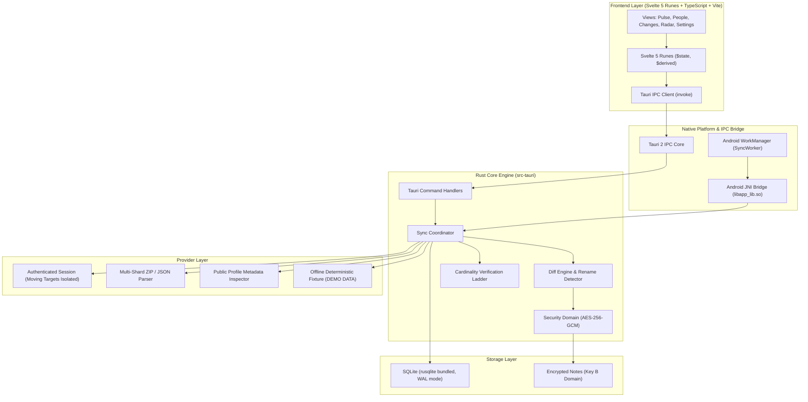
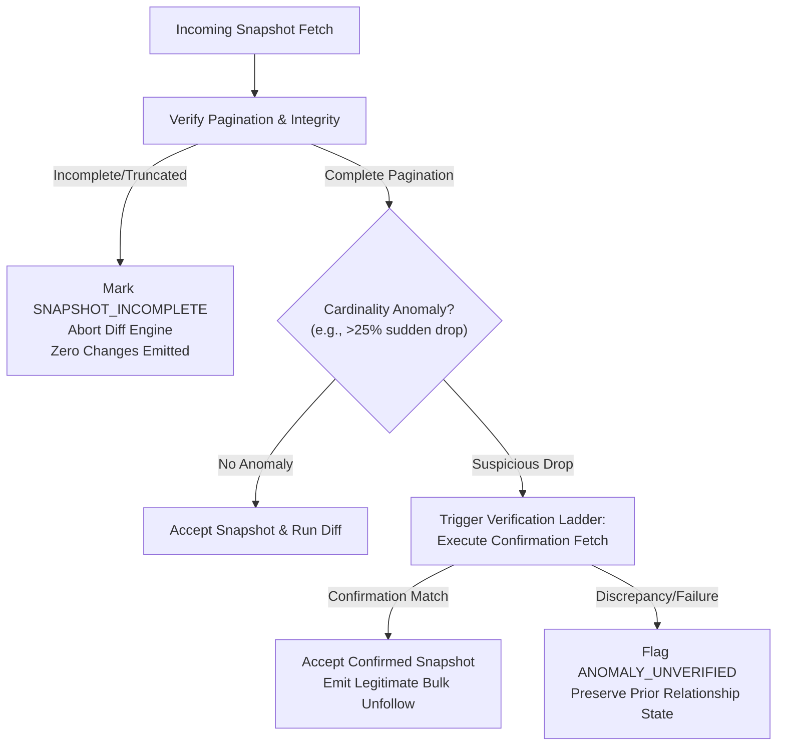
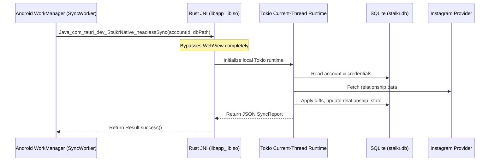

# Stalkr Architecture

## 1. System Philosophy & Non-Negotiables

Stalkr is a personal, private Android application built for monitoring Instagram follower/following relationships, account changes, mutual statuses, non-followbacks, and historical account dynamics.

### Core Non-Negotiables
1. **Local-First & Private**: All data, credentials, and snapshots remain on the physical device in an encrypted SQLite database. Zero external analytics, cloud sync, or remote logging.
2. **Correctness Over Fake Completeness**: An incomplete snapshot or rate-limited API response must **never** generate false unfollow events.
3. **No Frozen Upstream Endpoints**: Instagram session scraping mechanisms change over time. Provider-specific endpoints and transport logic are strictly isolated behind an abstract `InstagramProvider` trait.
4. **Honest Data Freshness**: If data is synthetic, it is clearly flagged as `DEMO DATA`. If a sync is partial, the UI displays `PARTIAL_SYNC` rather than claiming completeness.
5. **Universal Accessibility**: Every rich data visualization (e.g. the Concentric Radar Field) must have an instant Plain-List toggle.

---

## 2. Layered System Architecture

---

## 3. Storage & Relational Identity Model

### 3.1 Canonical People Identity vs Account Aliases
Social media users change their usernames frequently. Treating `@username` as a primary key creates identity fragmentation, broken historical records, and phantom follow/unfollow events.

1. **`accounts`**: The monitored Instagram account (you or your subjects).
   - `id`: Stable internal UUID.
   - `instagram_user_id`: Stable Meta numeric user ID.
   - `username`: Current handle.
2. **`account_aliases`**: Historical log of username renames for the monitored account.
3. **`people`**: Canonical entity for every discovered person.
   - `id`: Stable internal UUID.
   - `instagram_user_id`: Unique stable Instagram identity.
   - `current_username`: Latest known handle.
4. **`relationship_state`**: Materialized, query-optimized snapshot of current state:
   - `account_id` + `person_id` (Composite PK).
   - `is_follower`: Boolean.
   - `is_following`: Boolean.
   - `relationship_type`: `mutual`, `fan`, `following_only`, `none`.
   - `last_verified_at`: Timestamp.

---

## 4. Cardinality Verification Ladder

When Instagram rate limits or paginates incompletely, naive monitors assume missing users have unfollowed you. Stalkr uses a multi-tier verification ladder to prevent false unfollows:

---

## 5. Android Headless Background Synchronization

Android WorkManager operates under modern OS power restrictions:
- Minimum periodic interval: **15 minutes**.
- Cannot guarantee a WebView is active or that JavaScript can run.
- **Solution**: Native JNI Bridge (`StalkrNative.headlessSync`).

---

## 6. Provider Isolation Architecture

All data ingestion sources implement the unified `InstagramProvider` trait:

| Provider | Purpose | Characteristics |
|---|---|---|
| **Authenticated Session** | Live sync via active session | Mobile headers (`X-IG-App-ID: 936619743392459`), cursor pagination, rate-limit backoff, isolated transport. |
| **Multi-Shard Export** | Zero-risk official Meta archives | Auto-discovers `followers*.json` (shards 1..N) and `following*.json`. |
| **Public Profile** | Unauthenticated metadata | Strictly scoped to follower counts, bio, avatar, and verification flag. Never attempts list scraping. |
| **Deterministic Fixture** | Development & testing | Realistic simulated graphs labeled with prominent `DEMO DATA` banner. |
