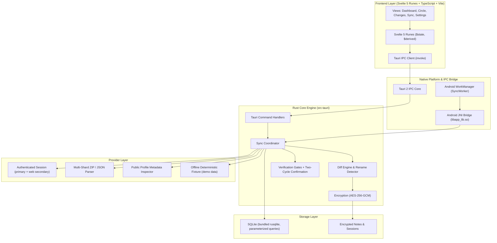
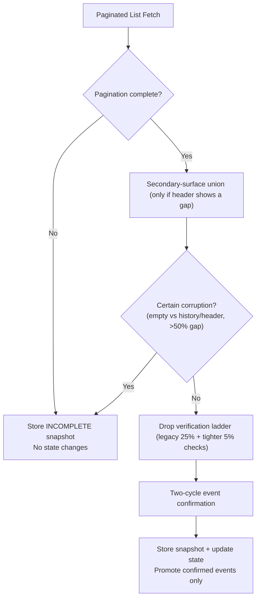
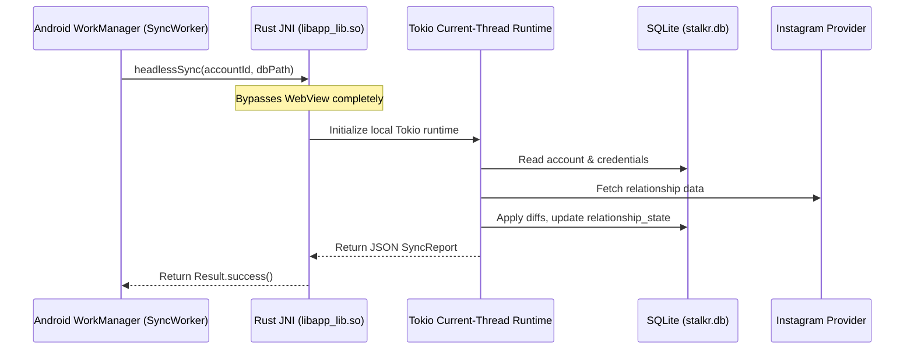

# Stalkr Architecture

## 1. System Philosophy & Non-Negotiables

Stalkr is a personal, private Android application for keeping an eye on Instagram follower/following relationships, account changes, mutual statuses, non-followbacks, and historical account dynamics — with safeguards designed to reduce false reports.

### Core Non-Negotiables
1. **Local-First & Private**: All data, credentials, and snapshots remain on the physical device in a local SQLite database. Zero external analytics, cloud sync, or remote logging.
2. **Caution Over Fake Completeness**: An incomplete snapshot or rate-limited API response should not become fake unfollow events. When data can't be trusted, the sync reports it honestly instead of inventing history.
3. **No Frozen Upstream Endpoints**: Instagram's unofficial endpoints change over time. Provider-specific transport is isolated behind an `InstagramProvider` trait with best-effort fallbacks.
4. **Honest Data Freshness**: If data is synthetic, it is flagged as demo data. If a sync is partial or unverified, the UI says so rather than claiming completeness.
5. **Universal Accessibility**: Dense visualizations ship with a Plain-List toggle.

---

## 2. Layered System Architecture

---

## 3. Storage & Relational Identity Model

### 3.1 Canonical People Identity vs Usernames

Social media users change their usernames frequently. Treating a handle as a primary key creates identity fragmentation and phantom follow/unfollow events, so people are keyed to stable numeric Instagram IDs with usernames kept as matchable aliases:

1. **`accounts`**: A connected owner account or a monitored target.
   - `id`: Stable internal UUID.
   - `instagram_user_id`: Stable numeric Instagram ID (when resolvable).
   - `username` / `display_name`: Current handle and name.
   - `followers_count` / `following_count`: Latest known official (header) counts.
   - `access_state`, `access_reason`, `target_privacy`, `last_access_checked_at`: Visibility of monitored targets through the connected session.
2. **`account_aliases`**: Historical log of past usernames (`account_id`, `username`).
3. **`people`**: Canonical entity for every discovered person.
   - `id`: Stable internal UUID.
   - `instagram_user_id`: Stable Instagram identity (nullable for export-origin rows, backfilled later).
   - `current_username`: Latest known handle.
4. **`relationship_state`**: Materialized current-state table for fast counters:
   - Composite PK (`account_id`, `person_id`).
   - `is_follower` / `is_following` flags plus `first_observed_at`, `last_observed_at`.
   - Stale rows pruned after every successful sync so counters can't drift on ghosts.
5. **`snapshots` + `snapshot_members`**: Complete per-sync membership records (`followers` / `following`, status `complete` / `incomplete` / `failed`).
6. **`relationship_changes`**: Feed events that survived confirmation (`followed_you`, `unfollowed_you`, `you_followed`, `you_unfollowed`, `username_changed` with old/new handle metadata).
7. **`pending_events`**: Candidate events awaiting two-cycle confirmation (never shown in the feed; auto-purged).

Derived views used by the UI: mutual = follower ∧ following; not-following-back = following ∧ ¬follower; fans = follower ∧ ¬following.

---

## 4. Sync Safeguards (What Stands Between a Wobble and Your Feed)

No safeguard can make unofficial endpoints perfectly reliable. Each layer below exists to *reduce* false reports, not to guarantee perfection:

1. **Pagination gate**: partial pages are stored as `incomplete` and change nothing.
2. **Header reconciliation**: the tracked list is compared against Instagram's official counts. Catastrophic mismatches are quarantined; moderate gaps proceed labeled `Unconfirmed`.
3. **Verification ladder**: sudden drops trigger a second fetch; inconsistent re-fetches downgrade confidence.
4. **Two-cycle confirmation**: appearances/disappearances enter the feed only if they persist into the next sync; one-off flaps and single-miss reappearances are discarded.
5. **Bootstrap honesty**: the first sync of a profile only stores a baseline and emits zero events — there is nothing to compare against yet.

---

## 5. Android Headless Background Synchronization

Android WorkManager operates under modern OS power restrictions:
- Minimum periodic interval: **15 minutes** (the app's recommended default is hourly with randomized jitter).
- Cannot guarantee a WebView is active or that JavaScript can run.
- **Solution**: Native JNI Bridge (`StalkrNative.headlessSync`).

---

## 6. Provider Isolation Architecture

All data ingestion sources implement the unified `InstagramProvider` trait (Rust `impl Trait` futures, with defaulted no-op secondary-surface methods that only the live session provider overrides):

| Provider | Purpose | Characteristics |
|---|---|---|
| **Authenticated Session** | Live sync via the user's own login session | Mobile friendships endpoints with cursor pagination; human-paced jittered delays; backoff and full stop on HTTP 429; optional web-GraphQL secondary surface unioned only when the header shows a gap |
| **Multi-Shard Export** | Official Meta data-download archives | Auto-discovers `followers*.json` shards and `following*.json`; treated as ground truth for the imported account |
| **Public Profile** | Unauthenticated metadata | Counts/avatar/verification only — never relationship lists |
| **Deterministic Fixture** | Development & testing | Synthetic graphs, always labeled demo data in the UI |

No view, command handler, or database routine depends on raw HTTP endpoints or response payloads directly.
