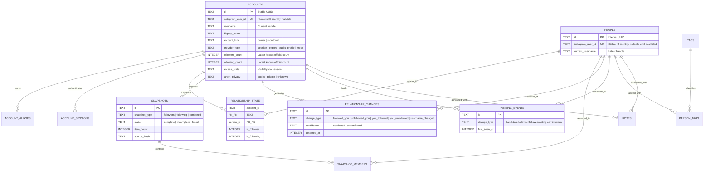

# Stalkr Data Model Specification

> This document mirrors `src-tauri/src/db/schema.rs` (the single source of truth). If anything here disagrees with that file, the file wins.

## 1. Relational Entity-Relationship Diagram



Full column lists (types SQLite, `INTEGER` booleans are `0`/`1`):

- **`accounts`**: `id`, `instagram_user_id` (UNIQUE), `username`, `display_name`, `account_kind`, `provider_type`, `avatar_url`, `is_private`, `is_verified`, `followers_count`, `following_count`, `monitoring_enabled`, `created_at`, `updated_at`, `last_successful_sync_at`, `last_attempted_sync_at`, `authenticated_by_account_id` (FK accounts, nulls on delete), `access_state`, `access_reason`, `target_privacy`, `last_access_checked_at`.
- **`account_sessions`**: `account_id` (PK, FK cascade), `session_data_ciphertext`, `nonce`, `last_validated_at`, `is_healthy`, `error_message`. Holds AES-256-GCM encrypted Instagram session material for owner accounts.
- **`account_aliases`**: (`account_id` FK cascade, `username`) composite PK, `first_seen_at`, `last_seen_at`.
- **`people`**: `id` (PK), `instagram_user_id` (UNIQUE, nullable), `current_username`, `display_name`, `avatar_url`, `is_verified`, `is_private`, `first_seen_at`, `last_seen_at`. Identity rule: the numeric ID is the join key when present; username matching (case-insensitive) is only a backfill path for ID-less rows and never merges two different numeric IDs.
- **`relationship_state`**: (`account_id` FK cascade, `person_id` FK cascade) composite PK, `is_follower`, `is_following`, `first_observed_at`, `last_observed_at`, `authenticated_by_account_id`. Rebuilt from the latest snapshots every sync; rows outside the current union are pruned so counters can't drift on ghosts.
- **`snapshots`**: `id` (PK), `account_id` (FK cascade), `snapshot_type`, `started_at`, `completed_at`, `status`, `item_count`, `source_hash`, `error_message`, `authenticated_by_account_id`. Only `complete` snapshots feed diffs and counts.
- **`snapshot_members`**: (`snapshot_id` FK cascade, `person_id` FK cascade) composite PK, `username_at_snapshot`, `display_name_at_snapshot`, `avatar_url_at_snapshot`.
- **`relationship_changes`**: `id` (PK), `account_id`/`person_id` (FK cascade), `related_username`, `change_type`, `confidence`, `metadata_json` (rename events carry old/new handles), `detected_at` (first-observed time for promoted events), `before_snapshot_id`/`after_snapshot_id` (FK snapshots), `authenticated_by_account_id`. Only confirmed events live here — this is what the Changes feed reads.
- **`pending_events`**: `id` (PK), `account_id`/`person_id` (FK cascade), `related_username`, `change_type`, `first_seen_at`, `first_snapshot_id` (plain reference, no FK), `authenticated_by_account_id`, plus `UNIQUE (account_id, person_id, change_type)`. An event lands in the feed only if it is still consistent on the following sync; contradicted pendings are deleted, and entries older than 14 days are purged.
- **`tags`** (`id` PK, `name` UNIQUE, `color`), **`person_tags`** ((`account_id`, `person_id`, `tag_id`) composite PK, FKs cascade).
- **`notes`**: `id` (PK), `account_id`/`person_id` (FK cascade), `content_ciphertext`, `nonce` (both Base64 AES-256-GCM material), `updated_at`, `UNIQUE (account_id, person_id)`.
- **`settings`**: (`key` PK, `value`) — e.g. per-account background-sync intervals.

---

## 2. Materialized Relationship States

The `relationship_state` table is maintained from the latest complete snapshots so counters read without reconstructing history:

| `is_follower` | `is_following` | UI meaning |
|---|---|---|
| `1` | `1` | Mutual |
| `1` | `0` | Fan (follows the tracked account, not followed back) |
| `0` | `1` | Not following back |
| `0` | `0` | Never stored (pruned) |

Dashboard headline numbers prefer the account's official header counts when known; the tracked-list counters above are shown as the verified subset.

---

## 3. Indexing Strategy (from `CREATE_INDICES_SQL`)

```sql
CREATE INDEX idx_accounts_username  ON accounts(username);
CREATE INDEX idx_accounts_ig_id     ON accounts(instagram_user_id);
CREATE INDEX idx_accounts_auth_by   ON accounts(authenticated_by_account_id);
CREATE INDEX idx_people_ig_id       ON people(instagram_user_id);
CREATE INDEX idx_people_username    ON people(current_username);
CREATE INDEX idx_rel_state_flags    ON relationship_state(account_id, is_follower, is_following);
CREATE INDEX idx_rel_state_auth_by  ON relationship_state(account_id, authenticated_by_account_id);
CREATE INDEX idx_snapshots_account  ON snapshots(account_id, started_at DESC);
CREATE INDEX idx_snapshots_auth_by  ON snapshots(account_id, authenticated_by_account_id);
CREATE INDEX idx_snapshot_members_person ON snapshot_members(person_id);
CREATE INDEX idx_rel_changes_account_date ON relationship_changes(account_id, detected_at DESC);
CREATE INDEX idx_rel_changes_person ON relationship_changes(person_id);
```

Snapshot recency ordering uses `completed_at DESC, ROWID DESC` so back-to-back syncs within the same second still resolve newest-first deterministically.
