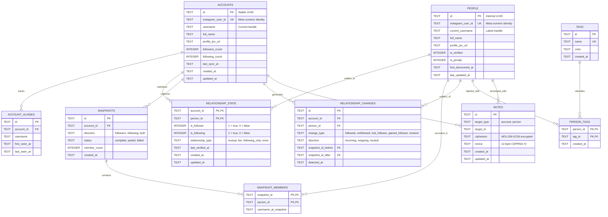

# Stalkr Data Model Specification

## 1. Relational Entity-Relationship Diagram



---

## 2. Materialized Relationship States

The `relationship_state` table is continuously maintained by the `DiffEngine` to allow sub-millisecond querying without reconstructing historical diff trees:

| `is_follower` | `is_following` | `relationship_type` | Visual Representation |
|---|---|---|---|
| `1` | `1` | `mutual` | Concentric Radar Ring 1 (Emerald) |
| `1` | `0` | `fan` | Concentric Radar Ring 2 (Amber) |
| `0` | `1` | `following_only` | Concentric Radar Ring 3 (Slate) |
| `0` | `0` | `none` | Archival / Historical only |

---

## 3. High-Performance Indexing Strategy

```sql
-- Fast filter by relationship type
CREATE INDEX idx_rel_state_type ON relationship_state (account_id, relationship_type);

-- Fast lookup of changes by time
CREATE INDEX idx_rel_changes_time ON relationship_changes (account_id, detected_at DESC);

-- Fast lookup of snapshots by account
CREATE INDEX idx_snapshots_account ON snapshots (account_id, created_at DESC);

-- Fast person lookup by Instagram identity
CREATE INDEX idx_people_ig_id ON people (instagram_user_id);
```
